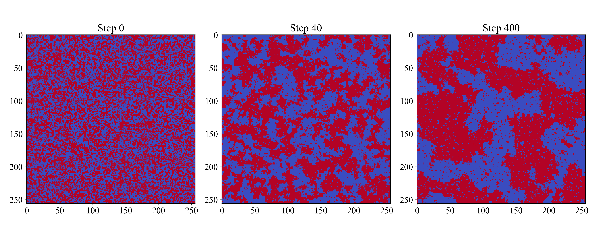

# ising-model-numba
Accelerating the Ising model with Numba

Figure: Indicative Ising Model states of a 256 by 256 lattice without an acting magnetic field. The random
initialization develops into a segregation field of opposing spins. The settings used for this simulation were
J = 1, h = 0, T = 2.15.
